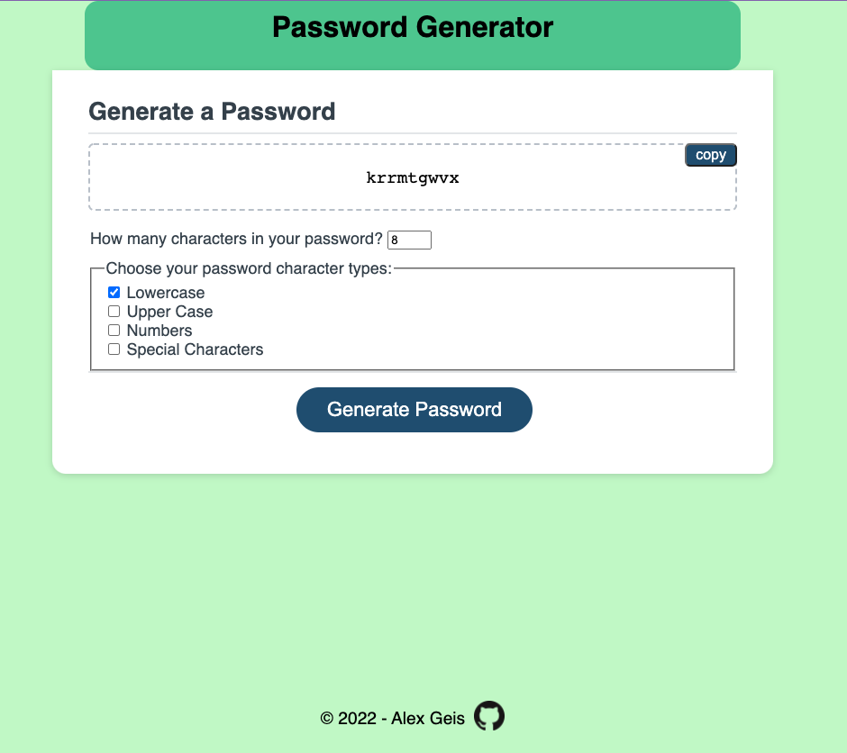

# Javascript Random Password Generator

This is an application that enables users to generate random passwords based on criteria that they’ve selected.

[Deployed Link](https://alexgeis.github.io/JS-Password-Generator/) &larr;&larr;

## User Story

```
AS AN employee with access to sensitive data
I WANT to randomly generate a password that meets certain criteria
SO THAT I can create a strong password that provides greater security
```

## Acceptance Criteria

```
GIVEN I need a new, secure password

WHEN prompted for password criteria
THEN I select which criteria to include in the password via checkboxes

WHEN prompted for the length of the password
THEN I choose a length of at least 8 characters and no more than 128 characters

WHEN asked for character types to include in the password
THEN I confirm whether or not to include lowercase, uppercase, numeric, and/or special characters

WHEN I click the button to generate a password
THEN I am presented with a password with my desired length and included character types

WHEN the password is generated
THEN the password is displayed

WHEN I select the copy button
THEN the generated password is copied to my clipboard
```

## Deployment Details

Repo: [JS Random Password Generator - Alex Geis Github](https://github.com/alexgeis/JS-Password-Homework)

GitHub Pages URL: [JS Random Password Generator](https://alexgeis.github.io/JS-Password-Homework/)

Screenshot: 
