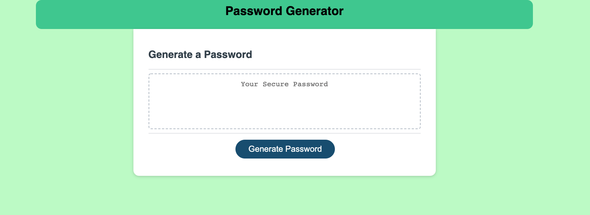

# JS-Password-Homework

Homework 03 - Javascript - Random Password Generator

## Your Task

This week’s homework requires you to modify starter code to create an application that enables employees to generate random passwords based on criteria that they’ve selected. This app will run in the browser and will feature dynamically updated HTML and CSS powered by JavaScript code that you write. It will have a clean and polished, responsive user interface that adapts to multiple screen sizes.

## User Story

```
AS AN employee with access to sensitive data
I WANT to randomly generate a password that meets certain criteria
SO THAT I can create a strong password that provides greater security
```

## Acceptance Criteria

```
GIVEN I need a new, secure password

WHEN I click the button to generate a password
THEN I am presented with a series of prompts for password criteria

WHEN prompted for password criteria
THEN I select which criteria to include in the password

WHEN prompted for the length of the password
THEN I choose a length of at least 8 characters and no more than 128 characters

WHEN asked for character types to include in the password
THEN I confirm whether or not to include lowercase, uppercase, numeric, and/or special characters

WHEN I answer each prompt
THEN my input should be validated and at least one character type should be selected

WHEN all prompts are answered
THEN a password is generated that matches the selected criteria

WHEN the password is generated
THEN the password is either displayed in an alert or written to the page
```

## Expected Mock-Up

The following image shows the web application's appearance and functionality:


## Execution Details

First, I broke up the needed steps into pseudo code (also attached in repo as a .txt file)
After establishing the flow of process, I started to break down the logic through JS.

I realized that by continually adding approved arrays (character types) into an empty array (user password), at the end of the process I could use a for loop to randomly iterate through the final combined array to output our randomized password.

## Deployment Details

Repo: [JS Random Password Generator - Alex Geis Github](https://github.com/alexgeis/JS-Password-Homework)

GitHub Pages URL: [JS Random Password Generator](https://alexgeis.github.io/JS-Password-Homework/)

Screenshot: 
